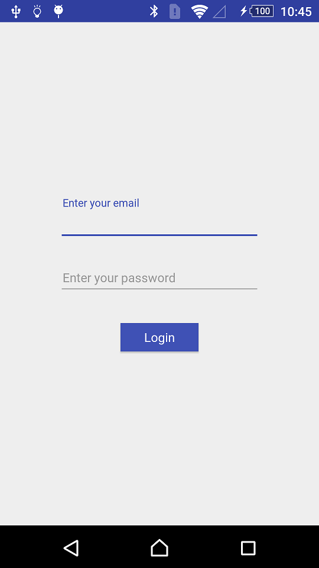
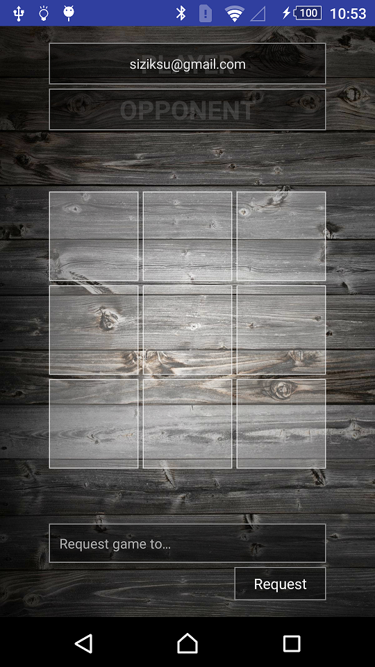
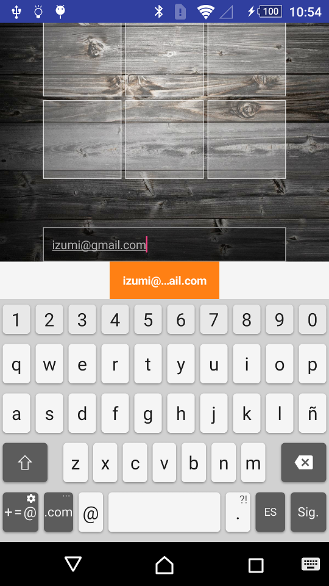
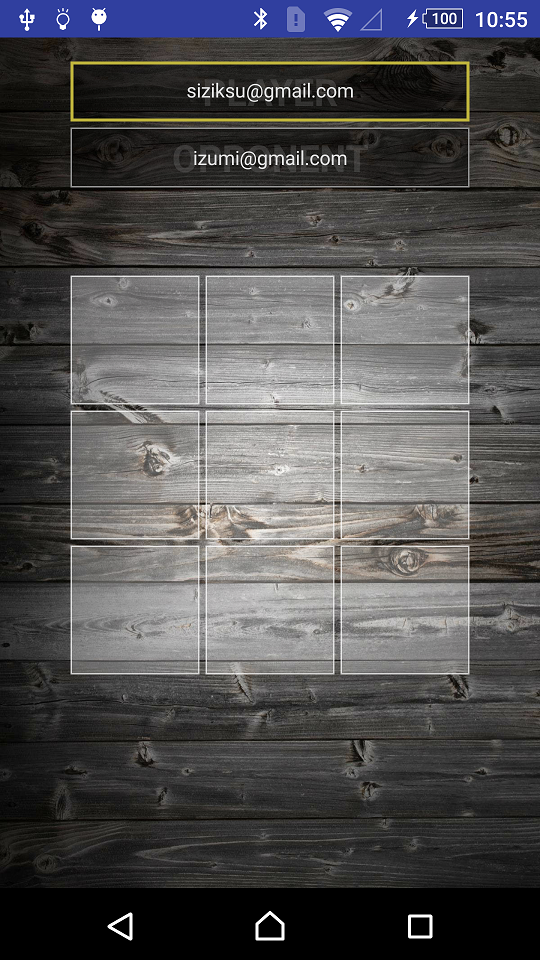
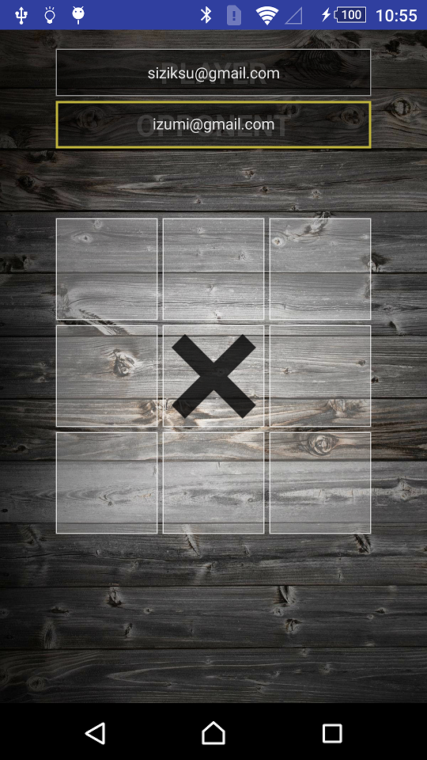
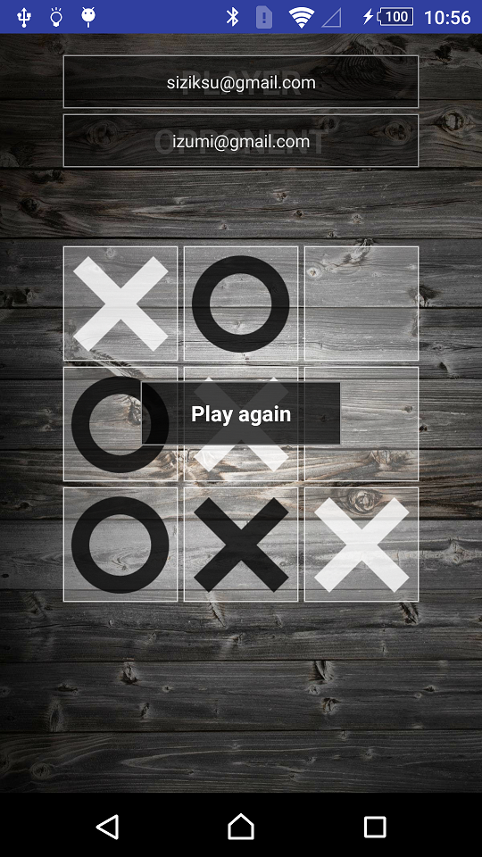
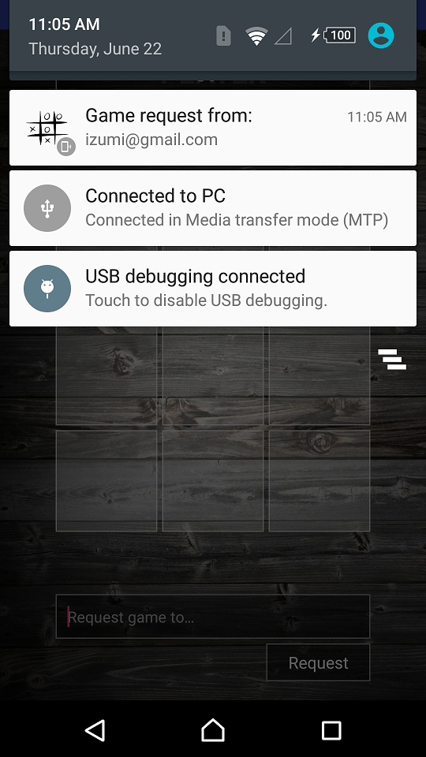

# Online TicTacToe

The classic Tic-Tac-Toe game for Android using __Kotlin__. It uses Google's __Firebase Realtime Database__.

## What is used here

- ConstraintLayout
- Kotlin
- Firebase Realtime Database
- Notifications
- BroadcastReceiver
- Preferences

## What do you need in order to make this work?

You will need to configure your Firebase account, change the package and add your own "google-services.json" to the application module.

## Keep in mind

This application is NOT using Cloud Messaging. The notifications are managed using the Firebase Realtime Database listeners.

## Screenshots

## License
    Copyright 2017 Esteban Latre
    
    Licensed under the Apache License, Version 2.0 (the "License");
    you may not use this file except in compliance with the License.
    You may obtain a copy of the License at
    
        http://www.apache.org/licenses/LICENSE-2.0
    
    Unless required by applicable law or agreed to in writing, software
    distributed under the License is distributed on an "AS IS" BASIS,
    WITHOUT WARRANTIES OR CONDITIONS OF ANY KIND, either express or implied.
    See the License for the specific language governing permissions and
    limitations under the License.
